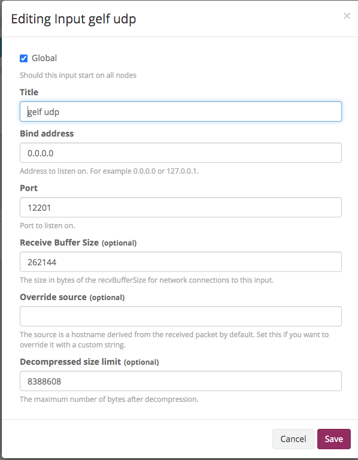
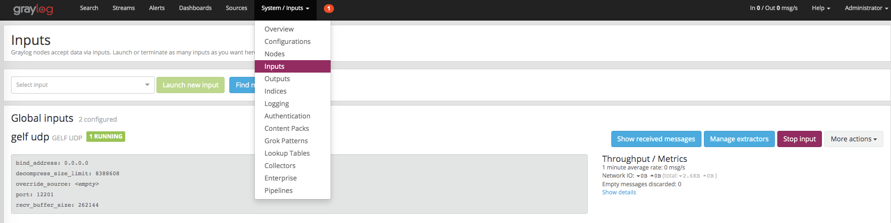

# logrus

[logrus](https://github.com/sirupsen/logrus)

[logrus-graylog-hook](github.com/gemnasium/logrus-graylog-hook/v3)

## create graylog udp input




## Code

```go

package main

import (
	graylog "github.com/gemnasium/logrus-graylog-hook/v3"
	"github.com/sirupsen/logrus"
	"io/ioutil"
	"os"
)

var log = logrus.New()

func init() {
	// Log as JSON instead of the default ASCII formatter.
	log.SetFormatter(&logrus.JSONFormatter{})

	// Output to stdout instead of the default stderr
	// Can be any io.Writer, see below for File example
	log.SetOutput(os.Stdout)

	// Only log the warning severity or above.
	log.SetLevel(logrus.InfoLevel)

	// create graylog hook instead of the default
	hook := graylog.NewGraylogHook("graylog_ip:graylog_port", map[string]interface{}{"this": "is log every time"})

	// flush the hook
	defer hook.Flush()

	// AddHook to the logrus
	log.AddHook(hook)

	// don't log to the system
	log.SetOutput(ioutil.Discard)
}

func main() {
	log.WithFields(logrus.Fields{
		"animal": "walrus",
		"size":   10,
	}).Info("xxxxxxxx")

	log.WithFields(logrus.Fields{
		"omg":    true,
		"number": 122,
	}).Warn("The group's number increased tremendously!")

	log.WithFields(logrus.Fields{
		"omg":    true,
		"number": 100,
	}).Fatal("The ice breaks!")

	// A common pattern is to re-use fields between logging statements by re-using
	// the logrus.Entry returned from WithFields()
	contextLogger := log.WithFields(logrus.Fields{
		"common": "this is a common field",
		"other": "I also should be logged always",
	})

	contextLogger.Info("I'll be logged with common and other field")
}

```
