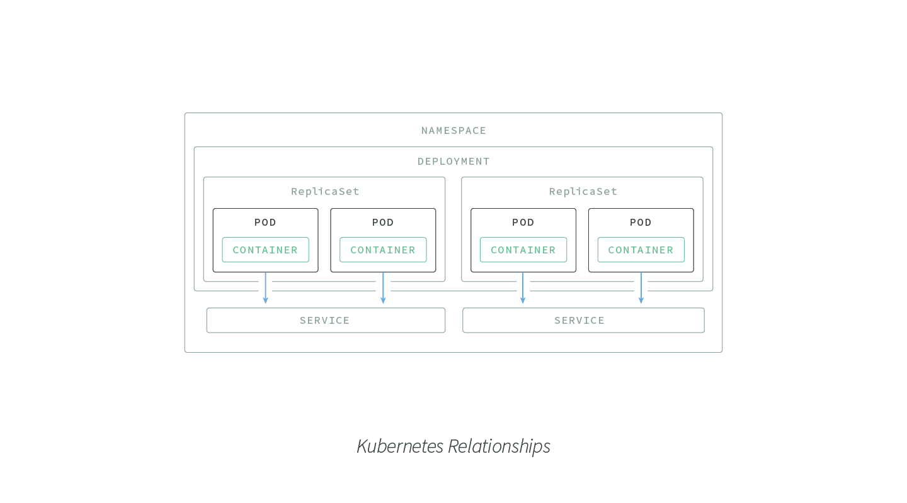
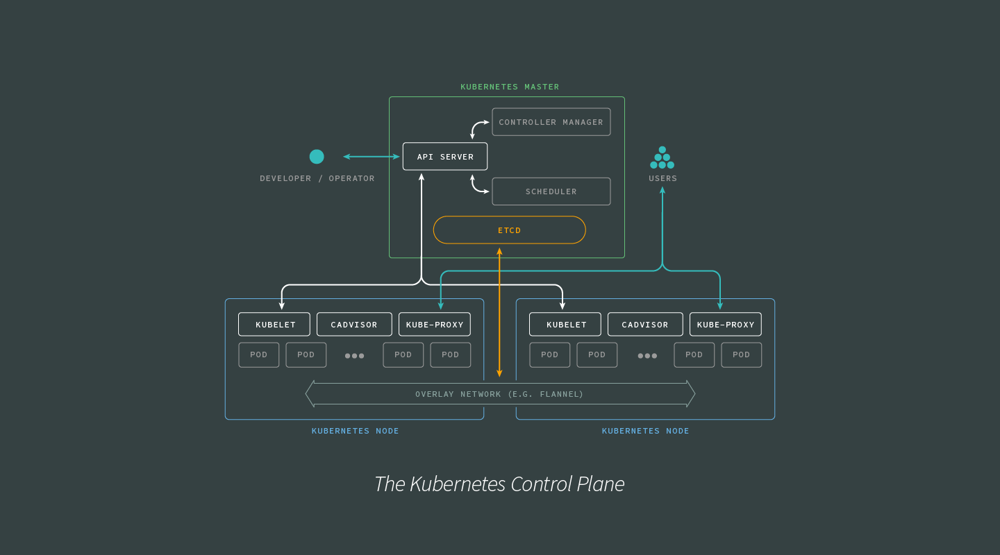
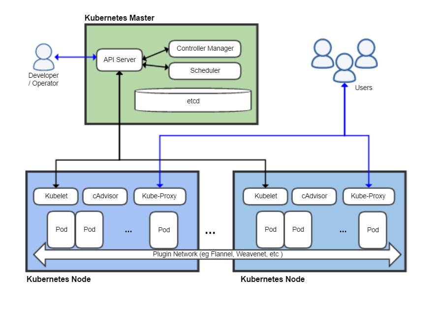
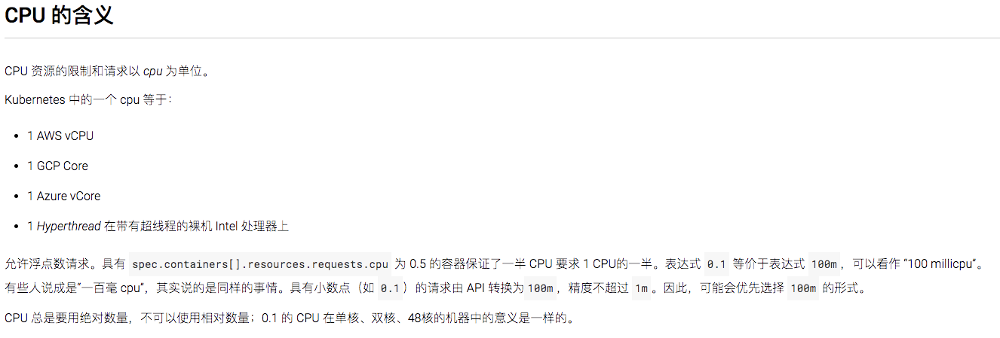
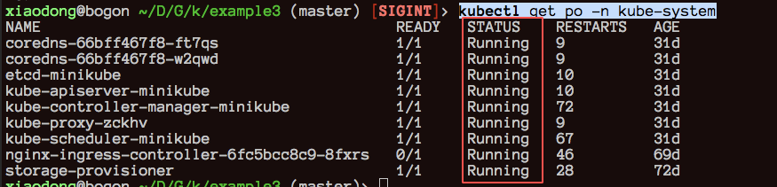
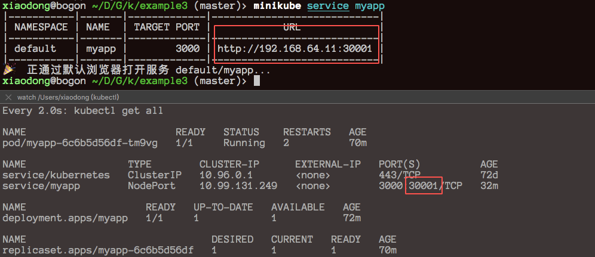
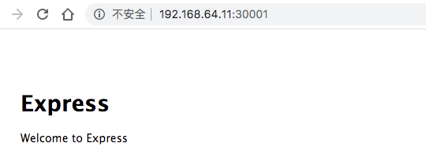
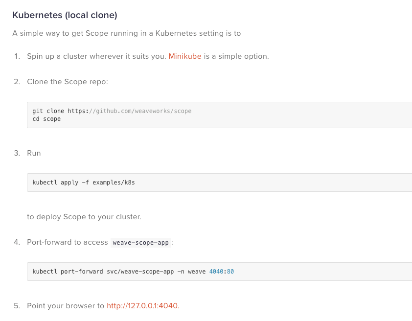

# 特性


# Kubernetes Architecture

The master-node based architecture of Kubernetes lends it to rapid, horizontal scaling. Networking features help facilitate rapid communication between, to, and from the various elements of Kubernetes.

Here are the core components of the Kubernetes architecture:

- **Pod:** The smallest deployable unit created and managed by Kubernetes, a Pod is a group of one or more containers. Containers within a Pod share an IP address and can access each other via localhost as well as enjoy shared access to volumes.
- **Node:** A worker machine in Kubernetes. May be a VM or a physical machine, and comes with services necessary to run *Pods*.
- **Service:** An abstraction which defines a logical set of Pods and a policy for accessing them. Assigns a fixed IP address to Pod replicas, allowing other Pods or Services to communicate with them.
- **ReplicaSet:** Ensures that a specified number of Pod replicas are running at any given time. K8s recommend using Deployments instead of directly manipulating ReplicaSet objects, unless you require custom update orchestration or don’t require updates at all.
- **Deployment:** A controller that provides declarative updates for Pods and ReplicaSets.
- **Namespace:** Virtual cluster backed by the same physical cluster. A way to divide cluster resources between multiple users, and a mechanism to attach authorization and policy to a subsection of a given cluster.

The following image provides a visual layout describing the various scopes of the Kubernetes components:







## Core Component 核心组件

### kube-apiserver

- kubectl命令行操作集群
- 集群间通信

### kube-controller-manager

### kube-scheduler

### kube-proxy


```shell
$ brew install minikube
// 虚拟机无权访问 k8s.gcr.io，或许您需要配置代理或者设置 --image-repository
$ minikube start --image-repository='registry.cn-hangzhou.aliyuncs.com/google_containers' --vm-driver=hyperkit


$ kubectl apply -f https://raw.githubusercontent.com/kubernetes/ingress-nginx/nginx-0.30.0/deploy/static/mandatory.yaml
$ minikube addons enable ingress
$ minikube ip # 192.168.64.10
$ sudo vim /etc/hosts (添加 192.168.64.10 foo.bar.com)

// 可视化工具 octant
$ brew install octant
$ octant

// 可视化工具Weave Scope
$ kubectl apply -f "https://cloud.weave.works/k8s/scope.yaml?k8s-version=$(kubectl version | base64 | tr -d '\n')&k8s-service-type=NodePort"
$ kubectl delete -f "https://cloud.weave.works/k8s/scope.yaml?k8s-version=$(kubectl version | base64 | tr -d '\n')&k8s-service-type=NodePort"
$ kubectl get pod -n weave
$ kubectl get svc -n weave
$ kubectl get deploy -n weave
kubectl apply -f "https://github.com/NextZeus/k8s-deploy-nodejs-app/blob/master/dashboard/weave-scope.yaml?k8s-version=$(kubectl version | base64 | tr -d '\n')&k8s-service-type=NodePort"
```


## port VS targetPort VS nodePort

- **Port** exposes the Kubernetes service on the specified port **within the cluster**(集群内访问). Other pods within the cluster can communicate with this server on the specified port.
- **TargetPort** is the port on which the service will send requests to, that your **pod will be listening on**. Your application in the container will need to be listening on this port also(进程端口).
- **NodePort** exposes a service **externally to the cluster**(集群外访问IP:NodePort) by means of the target nodes IP address and the NodePort. NodePort is the default setting if the port field is not specified.

#### 资料

[kubernetes-port-targetport-nodeport/](https://www.bmc.com/blogs/kubernetes-port-targetport-nodeport/)


# Service type

Kubernetes `ServiceTypes` 允许指定一个需要的类型的 Service，默认是 `ClusterIP` 类型。

`Type` 的取值以及行为如下：

- `ClusterIP`：通过集群的内部 IP 暴露服务，选择该值，服务只能够在集群内部可以访问，这也是默认的 `ServiceType`。
- [`NodePort`](https://kubernetes.io/zh/docs/concepts/services-networking/service/#nodeport)：通过每个 Node 上的 IP 和静态端口（`NodePort`）暴露服务。`NodePort` 服务会路由到 `ClusterIP` 服务，这个 `ClusterIP` 服务会自动创建。通过请求 `:`，可以从集群的外部访问一个 `NodePort` 服务。
- [`LoadBalancer`](https://kubernetes.io/zh/docs/concepts/services-networking/service/#loadbalancer)：使用云提供商的负载局衡器，可以向外部暴露服务。外部的负载均衡器可以路由到 `NodePort` 服务和 `ClusterIP` 服务。

  

## 负载均衡策略

### RoundRobin(默认)

- 轮询模式，即轮询将请求转发到后端的各个Pod上

### SessionAffinity

- -基于客户端IP地址进行会话保持的模式， 即第1次将某个客户端发起的请求转发到后端的某个Pod上， 之后从相同的客户端发起的请求都将被转发到后端相同的Pod上
- 设置service.spec.sessionAffinity=ClientIP来启用SessionAffinity策略


## K8S 之 使用GIT仓库作为存储卷

```yaml
apiVersion: v1
kind: Pod
metadata:
  name: gitrepo-volume-pod
  namespace: test
spec:
  containers:
    - image: nginx:alpine
      name: web-server
      volumeMounts:
        - mountPath: /usr/share/nginx/html
          name: html
          readOnly: true
      ports:
        - containerPort: 80
          protocol: TCP
  volumes:
    - name: html
      gitRepo:            #你正在创建一个gitRepo卷
        repository: https://github.com/luksa/kubia-website-example.git    #这个卷克隆至一个Git仓库
        revision: master       #使用那个主分支
        directory: .           #将repo克隆到卷的根目录，即/usr/share/nginx/html/
```

https://bbs.huaweicloud.com/blogs/160797


如果使用 Minikube，就不会有外部 IP 地址。外部 IP 地址将会一直是 pending 状态。

minikube ip

curl http://minikubeip:nodePort





# Deployment VS Pod

- 建议使用Deployment 配置创建Pod , 方便对Pod进行操作 


# MiniKube Status 

```shell
kubectl get po -n kube-system
```




# 访问服务






# Kubernetes install weavescope admin




## Error

```
error: unable to recognize "examples/k8s/psp.yaml": no matches for kind "PodSecurityPolicy" in version "extensions/v1beta1"


apiVersion 修改成 policy/v1beta1

```


# 常用命令


```
# 按Pod查看Container
kubectl get pods --all-namespaces -o=jsonpath="{..image}" -l app=myapp

# 扩展
kubectl scale --replicas=3 -f foo.yaml
kubectl scale --replicas=3 deployment/myapp
```


