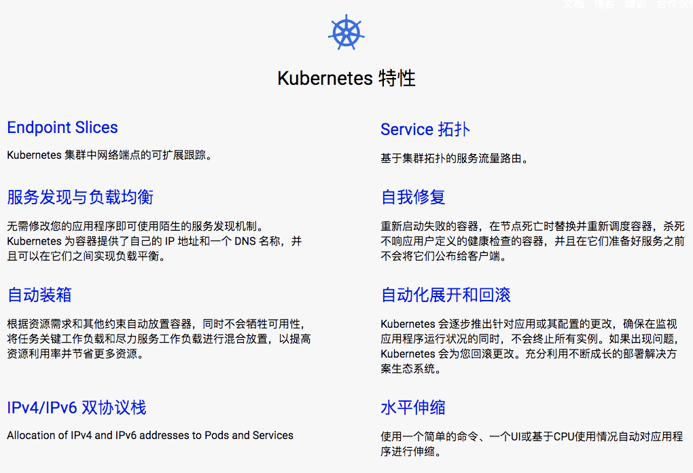
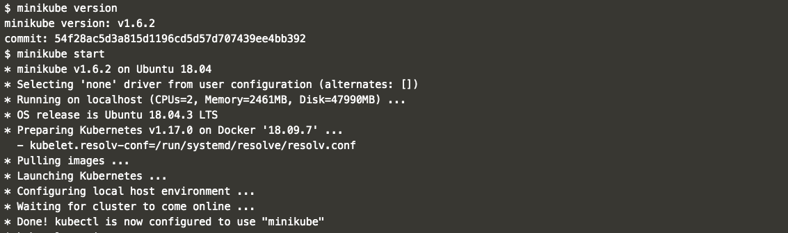
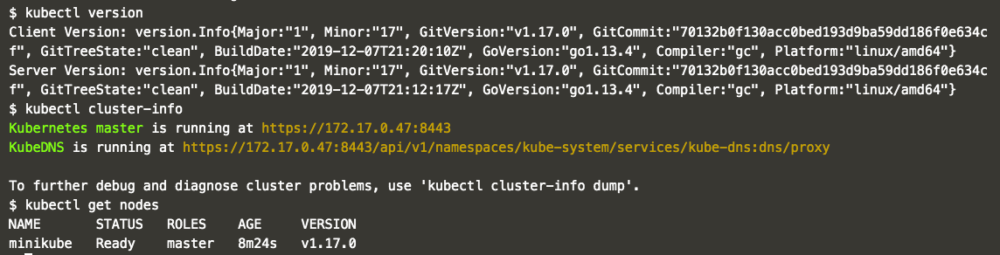
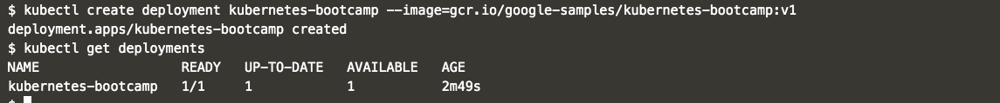
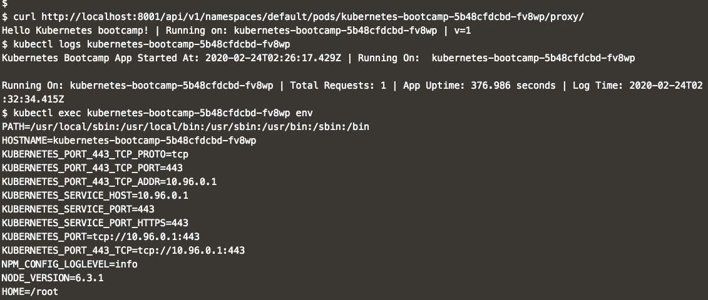
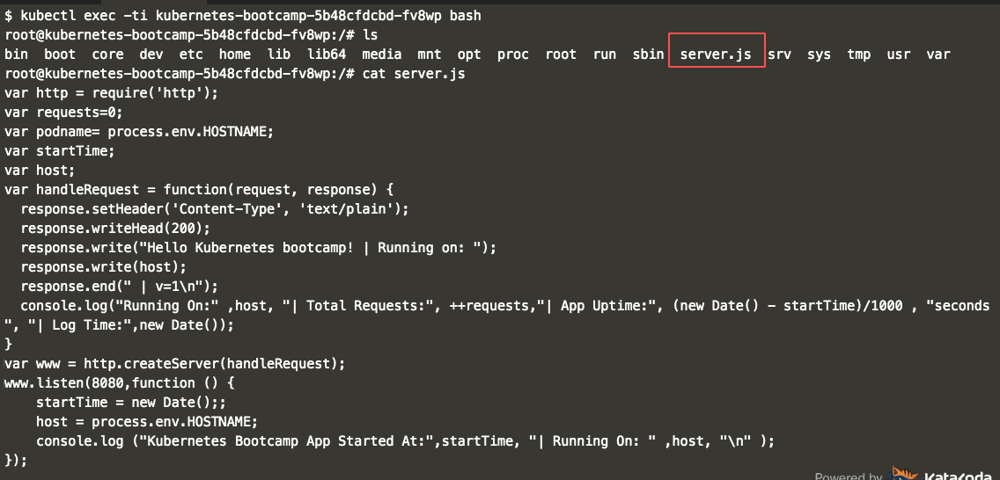
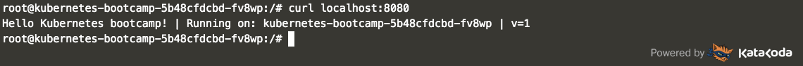

[TOC]


# Kubernetes

## Features



#### [Service discovery and load balancing 服务发现和负载平衡](https://kubernetes.io/docs/concepts/services-networking/service/)

No need to modify your application to use an unfamiliar service discovery mechanism. Kubernetes gives Pods their own IP addresses and a single DNS name for a set of Pods, and can load-balance across them. 

无需修改应用程序以使用不熟悉的服务发现机制。 Kubernetes 提供 Pods 自己的 IP 地址和一组 Pods 的单一 DNS 名称，并且可以在它们之间进行负载平衡

#### [Service Topology 服务拓扑](https://kubernetes.io/docs/concepts/services-networking/service-topology/)

Routing of service traffic based upon cluster topology. 

基于集群拓扑结构的服务流量路由

#### [EndpointSlices](https://kubernetes.io/docs/concepts/services-networking/endpoint-slices/) 端点切片

Scalable tracking of network endpoints in a Kubernetes cluster. 

Kubernetes 集群中网络端点的可伸缩跟踪

#### [Automatic bin packing 自动装箱](https://kubernetes.io/docs/concepts/configuration/manage-compute-resources-container/)

Automatically places containers based on their resource requirements and other constraints, while not sacrificing availability. Mix critical and best-effort workloads in order to drive up utilization and save even more resources. 

根据容器的资源需求和其他约束自动放置容器，同时不牺牲可用性。 混合关键工作量和最大努力工作量，以提高利用率和节省更多的资源

#### [Storage orchestration 存储业务流程](https://kubernetes.io/docs/concepts/storage/persistent-volumes/)

Automatically mount the storage system of your choice, whether from local storage, a public cloud provider such as 自动挂载您选择的存储系统，无论是从本地存储还是公共云提供商，如[GCP 全球气候控制计划](https://cloud.google.com/storage/) or 或[AWS 自动气象站](https://aws.amazon.com/products/storage/), or a network storage system such as NFS, iSCSI, Gluster, Ceph, Cinder, or Flocker. ，或网络存储系统，如 NFS、 iSCSI、 Gluster、 Ceph、 Cinder 或 Flocker

#### [Self-healing 自我修复](https://kubernetes.io/docs/concepts/workloads/controllers/replicationcontroller/#how-a-replicationcontroller-works)

Restarts containers that fail, replaces and reschedules containers when nodes die, kills containers that don’t respond to your user-defined health check, and doesn’t advertise them to clients until they are ready to serve. 

重新启动失败的容器，在节点死亡时替换和重新安排容器，杀死不响应用户定义的健康检查的容器，并且在它们准备好服务之前不向客户机发布它们的广告

#### [Automated rollouts and rollbacks 自动推出和回滚](https://kubernetes.io/docs/concepts/workloads/controllers/deployment/)

Kubernetes progressively rolls out changes to your application or its configuration, while monitoring application health to ensure it doesn’t kill all your instances at the same time. If something goes wrong, Kubernetes will rollback the change for you. Take advantage of a growing ecosystem of deployment solutions. 

Kubernetes 逐步对应用程序或其配置进行更改，同时监视应用程序的运行状况，以确保它不会同时杀死所有实例。 如果出了什么问题，库伯内特斯将为您回滚更改。 利用不断增长的部署解决方案生态系统

#### [Secret and configuration management 秘密与组态管理](https://kubernetes.io/docs/concepts/configuration/secret/)

Deploy and update secrets and application configuration without rebuilding your image and without exposing secrets in your stack configuration. 

部署和更新机密和应用程序配置，而无需重新生成映像，也无需在堆栈配置中公开机密

#### [IPv4/IPv6 dual-stack Ipv4 / ipv6双协议栈](https://kubernetes.io/docs/concepts/services-networking/dual-stack/)

Allocation of IPv4 and IPv6 addresses to Pods and Services 

分配Ipv4和 IPv6地址给Pods和服务

#### [Batch execution 批量执行](https://kubernetes.io/docs/concepts/workloads/controllers/jobs-run-to-completion/)

In addition to services, Kubernetes can manage your batch and CI workloads, replacing containers that fail, if desired. 

除了服务之外，Kubernetes 还可以管理你的批处理和 CI 工作负载，如果需要，可以替换失败的容器

#### [Horizontal scaling 横向扩展](https://kubernetes.io/docs/tasks/run-application/horizontal-pod-autoscale/)

Scale your application up and down with a simple command, with a UI, or automatically based on CPU usage. 使用简单的命令、 UI 或根据 CPU 使用情况自动调整应用程序的上下可伸缩性

## Create a Cluster

### Using Minikube to Create a Cluster


**The Master is responsible for managing the cluster.** The master coordinates all activities in your cluster, such as scheduling applications, maintaining applications' desired state, scaling applications, and rolling out new updates

Master 负责管理集群。 主服务器协调集群中的所有活动，例如调度应用程序、维护应用程序的期望状态、缩放应用程序和推出新的更新

**A node is a VM or a physical computer that serves as a worker machine in a Kubernetes cluster**. Each node has a Kubelet, which is an agent for managing the node and communicating with the Kubernetes master. The node should also have tools for handling container operations, such as Docker or rkt. A Kubernetes cluster that handles production traffic should have a minimum of three nodes.

节点是作为 Kubernetes 集群中的工作机器的 VM 或物理计算机。 每个节点都有一个 Kubelet，它是管理节点和与 kubernets 主节点通信的代理。 节点还应该具有处理容器操作的工具，如 Docker 或 rkt。 处理生产流量的 kubernettes 集群应该至少有三个节点.

**The nodes communicate with the master using the [Kubernetes API](https://kubernetes.io/docs/concepts/overview/kubernetes-api/)**, which the master exposes.

节点使用主服务器公开的 Kubernetes API 与主服务器通信

### Interactive Tutorial - Creating a Cluster

#### minikube

```shell
$ minikube version
$ minikube start
```



#### kubectl

```shell
$ kubectl version
$ kubectl cluster-info # show Cluster details
$ kubectl get nodes # shows all nodes
```




## Deploy an App

### Using kubectl to Create a Deployment

#### Kubernetes Deployments

Once you have a running Kubernetes cluster, you can deploy your containerized applications on top of it. To do so, you create a Kubernetes **Deployment** configuration. The Deployment instructs Kubernetes how to create and update instances of your application. Once you've created a Deployment, the Kubernetes master schedules mentioned application instances onto individual Nodes in the cluster.

一旦您有了一个正在运行的 Kubernetes 集群，您就可以在它之上部署您的容器化应用程序。 为此，您需要创建一个 Kubernetes **Deployment** 配置。 部署指示 Kubernetes 如何创建和更新应用程序的实例。 一旦创建了部署，Kubernetes 主计划就会提到将应用程序实例安排到集群中的单个节点上。

Once the application instances are created, a Kubernetes Deployment Controller continuously monitors those instances. If the Node hosting an instance goes down or is deleted, the Deployment controller replaces the instance with an instance on another Node in the cluster. **This provides a self-healing mechanism to address machine failure or maintenance.**

一旦应用程序实例被创建，一个 Kubernetes Deployment Controller 将持续监视这些实例。 如果承载实例的 Node 出现故障或被删除，则 Deployment 控制器将该实例替换为集群中另一个 Node 上的实例。 **这提供了一种自我修复机制来处理机器故障或维护**。

#### Deploying your first app on Kubernetes


You can create and manage a Deployment by using the Kubernetes command line interface, **Kubectl**. Kubectl uses the Kubernetes API to interact with the cluster.

您可以使用 Kubernetes 命令行界面创建和管理一个部署，**Kubectl**。 Kubectl 使用 Kubernetes API 与集群交互。 

### Interactive Tutorial - Deploying an App

#### Deploy our app

```shell
$ kubectl create deployment $deploymentName --image=$appImageLocation
$ kubectl create deployment kubernetes-bootcamp --image=gcr.io/google-samples/kubernetes-bootcamp:v1
```

`kubectl create deployment` command. We need to provide the deployment name and app image location (include the full repository url for images hosted **outside Docker hub**).

To list your deployments use the `get deployments` command




## Explore Your App

### Viewing Pods and Nodes

#### Kubernetees Pods

A Pod is a Kubernetes abstraction that represents a group of one or more application containers (such as Docker or rkt), and some shared resources for those containers. Those resources include:

Pod 是一个 Kubernetes 抽象，它表示一组或多个应用程序容器(如 Docker 或 rkt) ，以及这些容器的一些共享资源。这些资源包括:

- Shared storage, as Volumes 共享存储，作为卷
- Networking, as a unique cluster IP address 网络，作为唯一的群集 IP 地址
- Information about how to run each container, such as the container image version or specific ports to use 有关如何运行每个容器的信息，例如容器映像版本或要使用的特定端口

Pods are the atomic unit on the Kubernetes platform. When we create a Deployment on Kubernetes, that Deployment creates Pods with containers inside them (as opposed to creating containers directly). Each Pod is tied to the Node where it is scheduled, and remains there until termination (according to restart policy) or deletion. In case of a Node failure, identical Pods are scheduled on other available Nodes in the cluster.

Pods是库伯内特平台上的原子单位。 当我们在 Kubernetes 上创建一个 Deployment 时，Deployment 会创建包含容器的 Pods (而不是直接创建容器)。 每个 Pod 都绑定到节点的预定位置，并保持到终止(根据重新启动策略)或删除。 如果节点出现故障，则在集群中的其他可用节点上调度相同的 Pods。


#### Pods overview


#### Nodes

A Pod always runs on a **Node**. A Node is a worker machine in Kubernetes and may be either a virtual or a physical machine, depending on the cluster. Each Node is managed by the Master. A Node can have multiple pods, and the Kubernetes master automatically handles scheduling the pods across the Nodes in the cluster. The Master's automatic scheduling takes into account the available resources on each Node.

一个 Pod 总是在一个 Node 上运行。 Node 是 Kubernetes 的工作机器，可以是虚拟机，也可以是物理机器，这取决于集群。 每个节点由主节点管理。 一个 Node 可以有多个吊舱，Kubernetes 主机自动处理集群中 Nodes 之间的吊舱调度。 主机的自动调度考虑到了每个节点上的可用资源。

Every Kubernetes Node runs at least:

每个 Kubernetes Node 至少运行:

- Kubelet, a process responsible for communication between the Kubernetes Master and the Node; it manages the Pods and the containers running on a machine. Kubelet，一个负责 Kubernetes Master 和 Node 之间通信的进程; 它管理运行在机器上的 Pods 和容器
- A container runtime (like Docker, rkt) responsible for pulling the container image from a registry, unpacking the container, and running the application. 容器运行时(如 Docker，rkt)负责从注册表中提取容器映像，解压容器，并运行应用程序

*Containers should only be scheduled together in a single Pod if they are tightly coupled and need to share resources such as disk.*

如果容器是紧密耦合的并且需要共享资源(比如磁盘) ，那么只能将它们安排在一个 Pod 中。

#### Nodes overview


### Interactive Tutorial - Exploring Your app








## Expose Your App Publicly

### Using a Service to Expost Your App

### Interactive Tutorial - Exposing Your App


