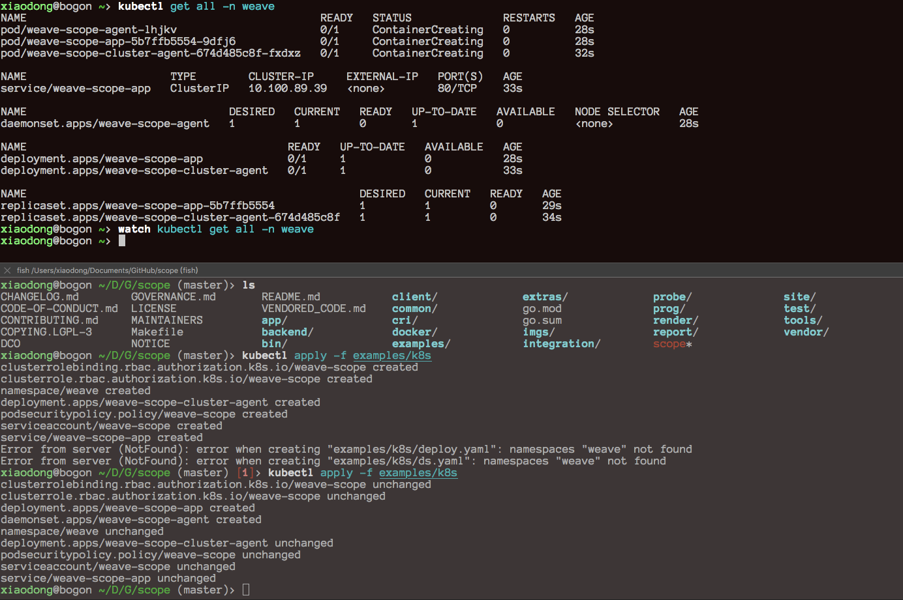
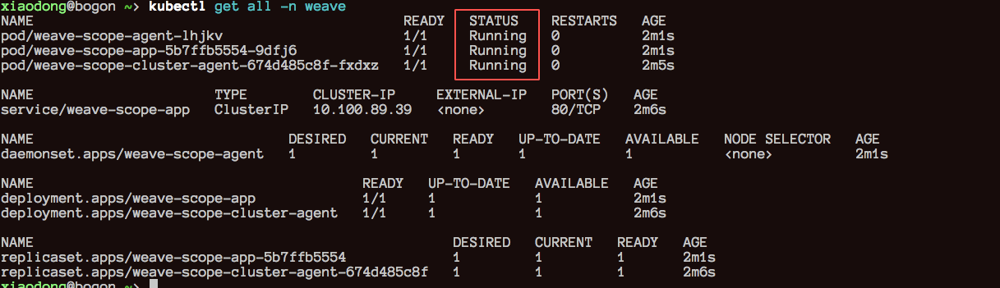
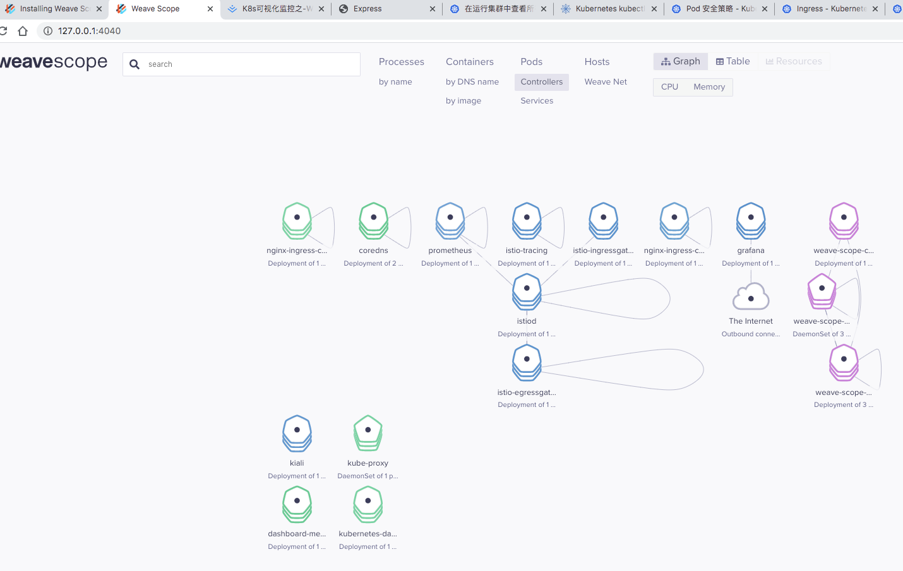
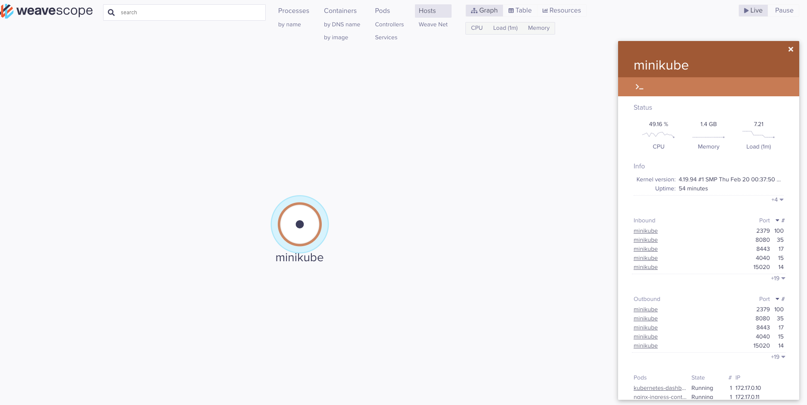
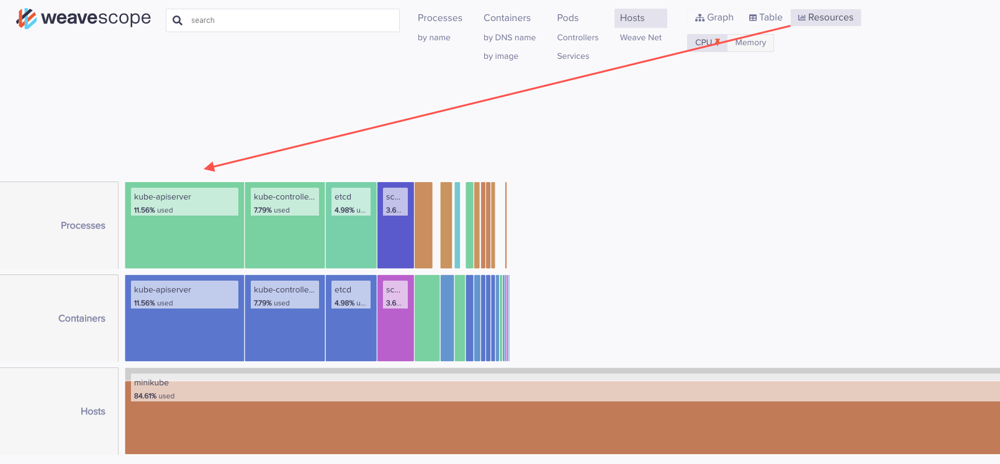

[阿里云服务器centos7 安装k8s]([http://ljchen.net/2018/10/23/%E5%9F%BA%E4%BA%8E%E9%98%BF%E9%87%8C%E4%BA%91%E9%95%9C%E5%83%8F%E7%AB%99%E5%AE%89%E8%A3%85kubernetes/](http://ljchen.net/2018/10/23/基于阿里云镜像站安装kubernetes/))


## 基于阿里云镜像站安装Kubernetes

 发表于 2018-10-23 | 分类于 [kubernetes ](http://ljchen.net/categories/kubernetes/)| 

kubernetes官网的文档比较详细，但是所有的安装步骤都有个前提(你有足够自由的互联络)，之前在香港和亚马逊的服务器都是直接照着手册执行脚本一路顺畅。无奈天朝的网络只能够借助于阿里云镜像站了，先前只是在使用该站点的各种linux发行版安装包，最近发现还支持了kubernetes。具体可以访问[阿里巴巴开源镜像站](https://opsx.alibaba.com/mirror)。

# 安装docker-ce

以下适用于centos 7

```
# step 1: 安装必要的一些系统工具
sudo yum install -y yum-utils device-mapper-persistent-data lvm2

# Step 2: 添加软件源信息
sudo yum-config-manager --add-repo http://mirrors.aliyun.com/docker-ce/linux/centos/docker-ce.repo
yum-config-manager --disable docker-ce-edge
yum-config-manager --disable docker-ce-test

# Step 3: 更新并安装 Docker-CE
sudo yum makecache fast
sudo yum -y install docker-ce

# Step 4: 开启Docker服务
sudo service docker start

# Step 5: 更改cgroup driver
cat > /etc/docker/daemon.json <<EOF
{
  "exec-opts": ["native.cgroupdriver=systemd"],
  "log-driver": "json-file",
  "log-opts": {
    "max-size": "100m"
  },
  "storage-driver": "overlay2",
  "storage-opts": [
    "overlay2.override_kernel_check=true"
  ]
}
EOF
```

以下命令适用于ubuntu

```
# step 1: 安装必要的一些系统工具
sudo apt-get update
sudo apt-get -y install apt-transport-https ca-certificates curl software-properties-common

# step 2: 安装GPG证书
curl -fsSL http://mirrors.aliyun.com/docker-ce/linux/ubuntu/gpg | sudo apt-key add -

# Step 3: 写入软件源信息
sudo add-apt-repository "deb [arch=amd64] http://mirrors.aliyun.com/docker-ce/linux/ubuntu $(lsb_release -cs) stable"

# Step 4: 更新并安装 Docker-CE
sudo apt-get -y update
sudo apt-get -y install docker-ce

# Step 5: 更改cgroup driver
cat > /etc/docker/daemon.json <<EOF
{
  "exec-opts": ["native.cgroupdriver=systemd"],
  "log-driver": "json-file",
  "log-opts": {
    "max-size": "100m"
  },
  "storage-driver": "overlay2",
  "storage-opts": [
    "overlay2.override_kernel_check=true"
  ]
}
EOF
```

# 安装二进制文件

主要是安装`kubelet`、`kubeadm`以及`kubectl`这三个可执行文件。其中kubeadm是官方的安装工具，kubectl是客户端，kubelet这个就不用介绍了。

## 安装阿里云的k8s-yum源

以下是针对于CentOS的yum源，官方也有针对Ubuntu的源。

```
cat <<EOF > /etc/yum.repos.d/kubernetes.repo
[kubernetes]
name=Kubernetes
baseurl=http://mirrors.aliyun.com/kubernetes/yum/repos/kubernetes-el7-x86_64
enabled=1
gpgcheck=0
repo_gpgcheck=0
gpgkey=http://mirrors.aliyun.com/kubernetes/yum/doc/yum-key.gpg
       http://mirrors.aliyun.com/kubernetes/yum/doc/rpm-package-key.gpg
EOF
```

## 安装kubelet

如果你希望直接安装最新发布版本的k8s，请直接执行（最终安装的版本关键看你安装的kubeadm版本）。

```
setenforce 0
yum install -y kubelet kubeadm kubectl --disableexcludes=kubernetes
systemctl enable docker && systemctl start docker
systemctl enable kubelet && systemctl start kubelet
```

## 调参运行

照着执行就行了。

```
cat <<EOF >  /etc/sysctl.d/k8s.conf
net.bridge.bridge-nf-call-ip6tables = 1
net.bridge.bridge-nf-call-iptables = 1
net.ipv4.ip_forward = 1
EOF
sysctl --system

systemctl daemon-reload
systemctl restart kubelet
```

# 容器组件

## 拉取镜像

google和docker似乎是有意要对着干的，虽然阿里云也有docker registry的加速器，但是google并没有将kubernetes的镜像放到docker hub上。所以，我们需要先使用脚本，从阿里云的google_containers命名空间下载对应的克隆镜像，然后再通过docker tag将其labels修改为kubeadm生成的static-pod yaml文件对应的镜像标签。从而欺骗kubeadm，所有镜像都已经ready了，不用再去公网上拉取了。

具体操作如下：

### 镜像列表

你肯定会疑问，我怎么知道我要使用哪些镜像？

好在v1.12.2以上的版本，kubeadm提示可以使用以下命令来获取到镜像信息：

```
[root@k8s-master manifests]# kubeadm config images list
k8s.gcr.io/kube-apiserver:v1.12.2
k8s.gcr.io/kube-controller-manager:v1.12.2
k8s.gcr.io/kube-scheduler:v1.12.2
k8s.gcr.io/kube-proxy:v1.12.2
k8s.gcr.io/pause:3.1
k8s.gcr.io/etcd:3.2.24
k8s.gcr.io/coredns:1.2.2
```

从阿里云拉取镜像

```shell
[root@k8s-master manifests]# cat ./pull.sh
for i in `kubeadm config images list`; do 
  imageName=${i#k8s.gcr.io/} #截取k8s.grc.io/后的字符串
  # imageName=${i:11} centos8 上面的截取方式不可用 使用索引截取可用
  docker pull registry.cn-hangzhou.aliyuncs.com/google_containers/$imageName
  docker tag registry.cn-hangzhou.aliyuncs.com/google_containers/$imageName k8s.gcr.io/$imageName
  docker rmi registry.cn-hangzhou.aliyuncs.com/google_containers/$imageName
done;
```


## 安装k8s

这就是kubeadm的安装流程了；下面是部署单节点k8s的命令，如果需要部署k8s集群，可以通过指定config文件的方式来指定其etcd集群，并使用相同的方式部署多个api-server、controller-manager以及scheduler。

### k8s

```
kubeadm config print --init-defaults > kubeadm-init.conf (centos8)
[root@k8s-master manifests]# kubeadm init --kubernetes-version=$(kubeadm version -o short)  --pod-network-cidr=10.244.0.0/16
[init] using Kubernetes version: v1.12.2
[preflight] running pre-flight checks
[preflight/images] Pulling images required for setting up a Kubernetes cluster
[preflight/images] This might take a minute or two, depending on the speed of your internet connection
[preflight/images] You can also perform this action in beforehand using 'kubeadm config images pull'
```

## 安装网络组件

我比较喜欢使用flannel，可以配置不同的backend来支持多种类型的网络。当然，如果对网络安全有特殊的限制，可以考虑其他的组件.

```
kubectl apply -f https://raw.githubusercontent.com/coreos/flannel/bc79dd1505b0c8681ece4de4c0d86c5cd2643275/Documentation/kube-flannel.yml
```

## 取消污点

这是因为我就只有一台机器，如果不干掉这个taint就无法调度pod。

```
kubectl taint nodes --all node-role.kubernetes.io/master-
```


## 安装WeaveScope

Weave Scope是Docker和Kubernetes的可视化和监视工具。它提供了自上而下的应用程序视图以及整个基础架构视图，并允许您实时诊断将分布式容器化应用程序部署到云提供商时遇到的任何问题

https://www.weave.works/docs/scope/latest/installing/

```
git clone https://github.com/weaveworks/scope
cd scope
kubectl apply -f examples/k8s
kubectl port-forward svc/weave-scope-app -n weave 4040:80
http://127.0.0.1:4040

清理
kubectl delete -f examples/k8s
```






执行完以上命令后，在浏览器里面访问执行命令所在的节点的http://{IP}:4040，将看到以下界面。是不是很炫酷！

[](http://ljchen.net/uploads/weavescope-demo.png)








# 阿里巴巴开源镜像站

> 站点附图，请自行点击kubernetes的帮助。

[](http://ljchen.net/uploads/aliyun-mirror.png)

- **本文作者：** ljchen
- **本文链接：** http://ljchen.net/2018/10/23/基于阿里云镜像站安装kubernetes/
- **版权声明：** 本博客所有文章除特别声明外，均采用 [CC BY-NC-SA 3.0](https://creativecommons.org/licenses/by-nc-sa/3.0/) 许可协议。转载请注明出处！

# 安装过程遇到的问题

## 需要关闭防火墙

```shell
systemctl stop firewalld
systemctl disable firewalld
```

## k8s yum install 出现的问题。网络不可达！！！

报的是这个错。

https://packages.cloud.google.com/yum/repos/kubernetes-el7-x86_64/repodata/repomd.xml: [Errno 14] curl#7 - "Failed to connect to 2404:6800:4012::200e: Network is unreachable"
解决办法：

修改 vim /etc/yum.repos.d/kubernetes.repo

[kubernetes]
name=Kubernetes
baseurl=http://mirrors.aliyun.com/kubernetes/yum/repos/kubernetes-el7-x86_64
enabled=1
gpgcheck=0
repo_gpgcheck=0
gpgkey=http://mirrors.aliyun.com/kubernetes/yum/doc/yum-key.gpg
        http://mirrors.aliyun.com/kubernetes/yum/doc/rpm-package-key.gpg
不在使用谷歌的镜像换成 国内镜像，

点赞 1
————————————————
版权声明：本文为CSDN博主「weixin_42127141」的原创文章，遵循 CC 4.0 BY-SA 版权协议，转载请附上原文出处链接及本声明。
原文链接：https://blog.csdn.net/weixin_42127141/article/details/84565021