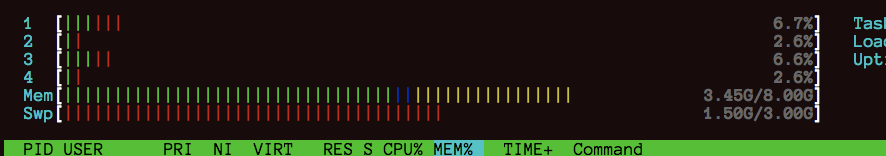
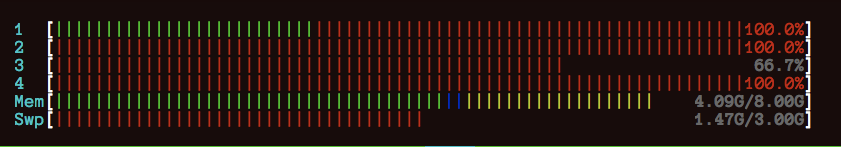
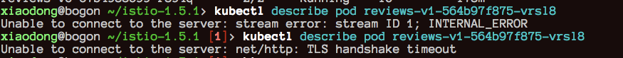

```shell
$ brew install minikube
$ minikube version
minikube version: v1.9.2
commit: 93af9c1e43cab9618e301bc9fa720c63d5efa393
xiaodong@bogon ~> minikube start --image-repository='registry.cn-hangzhou.aliyuncs.com/google_containers' --vm-driver=hyperkit
😄  Darwin 10.13.3 上的 minikube v1.9.2
✨  根据现有的配置文件使用 hyperkit 驱动程序
💾  正在下载驱动 docker-machine-driver-hyperkit:
    > docker-machine-driver-hyperkit.sha256: 65 B / 65 B [---] 100.00% ? p/s 0s
    > docker-machine-driver-hyperkit: 10.90 MiB / 10.90 MiB  100.00% 104.85 KiB
🔑  The 'hyperkit' driver requires elevated permissions. The following commands will be executed:

    $ sudo chown root:wheel /Users/xiaodong/.minikube/bin/docker-machine-driver-hyperkit
    $ sudo chmod u+s /Users/xiaodong/.minikube/bin/docker-machine-driver-hyperkit


Password:
👍  Kubernetes 1.18.0 现在可用了。如果您想升级，请指定 --kubernetes-version=1.18.0
✅  正在使用镜像存储库 registry.cn-hangzhou.aliyuncs.com/google_containers
💿  正在下载 VM boot image...
    > minikube-v1.9.0.iso.sha256: 65 B / 65 B [--------------] 100.00% ? p/s 0s
    > minikube-v1.9.0.iso: 174.93 MiB / 174.93 MiB  100.00% 115.25 KiB p/s 25m5
👍  Starting control plane node m01 in cluster minikube
💾  Downloading Kubernetes v1.17.3 preload ...
    > preloaded-images-k8s-v2-v1.17.3-docker-overlay2-amd64.tar.lz4: 580.08 MiB
🔄  Restarting existing hyperkit VM for "minikube" ...
💡  Existing disk is missing new features (lz4). To upgrade, run 'minikube delete'
🐳  正在 Docker 19.03.6 中准备 Kubernetes v1.17.3…
🌟  Enabling addons: default-storageclass, storage-provisioner
🏄  完成！kubectl 已经配置至 "minikube"

$ minikube status
$ minikube stop
$ minikube start 


$ kubectl create namespace <namespace> # 给应用创建命名空间
# Istio sidecar 注入器将自动注入 Envoy 容器到应用的 pod
# 前提是 pod 启动在标有 istio-injection=enabled 的命名空间中
$ kubectl label namespace <namespace> istio-injection=enabled


```






CPU 飙升 ，内存倒还好

kubectl 命令超时



```shell
xiaodong@bogon ~ [SIGINT]> minikube start --kubernetes-version=1.18.0
😄  Darwin 10.13.3 上的 minikube v1.9.2
✨  根据现有的配置文件使用 hyperkit 驱动程序
👍  Starting control plane node m01 in cluster minikube
💾  Downloading Kubernetes v1.18.0 preload ...
    > preloaded-images-k8s-v2-v1.18.0-docker-overlay2-amd64.tar.lz4: 542.91 MiB
🔄  Restarting existing hyperkit VM for "minikube" ...
💡  Existing disk is missing new features (lz4). To upgrade, run 'minikube delete'
🐳  正在 Docker 19.03.6 中准备 Kubernetes v1.18.0…
    > kubeadm.sha256: 65 B / 65 B [--------------------------] 100.00% ? p/s 0s
    > kubectl.sha256: 65 B / 65 B [--------------------------] 100.00% ? p/s 0s
    > kubelet.sha256: 65 B / 65 B [--------------------------] 100.00% ? p/s 0s
    > kubeadm: 37.96 MiB / 37.96 MiB [-----------] 100.00% 365.96 KiB p/s 1m47s
    > kubectl: 41.98 MiB / 41.98 MiB [-----------] 100.00% 394.54 KiB p/s 1m49s
    > kubelet: 108.01 MiB / 108.01 MiB [---------] 100.00% 510.96 KiB p/s 3m36s
🌟  Enabling addons: default-storageclass, storage-provisioner
🏄  完成！kubectl 已经配置至 "minikube"
xiaodong@bogon ~>
xiaodong@bogon ~>
xiaodong@bogon ~> minikube status
m01
host: Running
kubelet: Running
apiserver: Running
kubeconfig: Configured

xiaodong@bogon ~/istio-1.5.1> kubectl version
Client Version: version.Info{Major:"1", Minor:"18", GitVersion:"v1.18.1", GitCommit:"7879fc12a63337efff607952a323df90cdc7a335", GitTreeState:"clean", BuildDate:"2020-04-10T21:53:40Z", GoVersion:"go1.14.2", Compiler:"gc", Platform:"darwin/amd64"}
Server Version: version.Info{Major:"1", Minor:"18", GitVersion:"v1.18.0", GitCommit:"9e991415386e4cf155a24b1da15becaa390438d8", GitTreeState:"clean", BuildDate:"2020-03-25T14:50:46Z", GoVersion:"go1.13.8", Compiler:"gc", Platform:"linux/amd64"}

```


