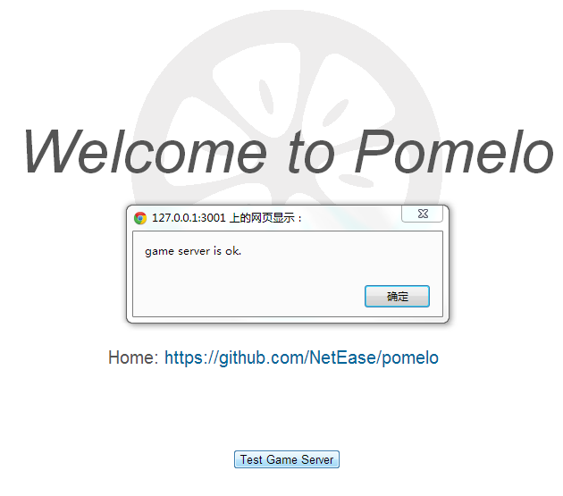
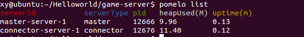

Let's start our pomelo tour with example "HelloWorld".
우리 pomelo의 HelloWorld 여행을 시작해 봅시다.

New a Project 새로운 프로젝트
===========

Use pomelo command line tool to create a project quickly, the command is shown as follows:

Pomelo 커맨드 라인 툴을 사용하여 프로젝트를 빠르게 생성합니다, 다음과 같이 명령이 표시됩니다.

    $ pomelo init ./HelloWorld

Or you can use the three commands below:

또는 당신은 세가지 명령을 사용할 수 있습니다:
 

    $ mkdir HelloWorld
    $ cd HelloWorld
    $ pomelo init

These two ways are equivalent, for more about pomelo command line, please refer to [pomelo command-line tool](pomelo-command-line-Usage). **NOTE**, during initialization of project, users need to select the underlying communication protocol, socket.io or websocket.

이러한 두가지 방법은 동일한데, pomelo 명령 라인에 대해 자세한 것은 [pomelo command-line tool](pomelo-command-line-Usage)를 참조하세요. ***NOTE**, 프로젝트를 초기화 하는 동안, 사용자는 기본적으로 통신프로토콜, socket.io 혹은 websocket을 선택해야 합니다.

Then, go into HelloWorld directory, install its dependencies by:

그런 다음 종속성을 설치 하여 HelloWorld 디렉토리로 이동합니다.

    $ sh npm-install.sh

if you are a windows user, you should run `npm-install.bat` instead.

만약 당신이 윈도우 사용자라면, 당신은 대신 'npm-install.bat'을 실행해야 합니다.

Project Directory Structure 프로젝트 디렉토리 구조
=============================

Let's look at the general structure of a pomelo project.

pomelo 프로젝트의 일반 구조를 살펴 봅시다.

The newly created project structure is shown below:

새로 만든 프로젝트의 구조는 다음과 같습니다.

![Project directory structure] (images/HelloWorldFolder.png)

By filling the relevant code to corresponding directory, you can develop game server quickly. The following is a brief analysis of each directory and its sub-directory of a pomelo project:

해당 디렉토리와 관련되 코드를 작성하여, 당신은 신속하게 게임서버를 개발할 수 있습니다. 다음은 pomelo 프로젝트의 하위 디렉토리와 각 디렉토리에 대한 간략한 분석입니다.

#### game-server 게임 서버

Game-server contains the game logic code, using the file app.js as the entrance point to run all the game logics and functionality, and all the game logic , functionalities , configurations, and so on are placed into this directory.

게임 서버는 모든 게임 로직과 기능을 실행할 수 있는 진입점으로 파일 app.js를 사용하여 게임 로직 코드를 포함하고, 모든 게임 로직, 가능성, 배열, 기타 등등은 이 디렉토리에 배치됩니다.

* app subdirectory 응용 프로그램의 하위 디렉토리

All the game logic and functionality related code will be placed here, where users can implement different types of servers, by adding Handlers, Remotes, Components etc. to server.

사용자가 서버의 다른 유형을 구현할 수 있는 모든 게임 로직과 기능성이 관련된 코드는 서버에 처리기, 원격접속, 구성요소 등을 추가하여 여기에 배치됩니다.

* config subdirectory 구성 하위 디렉토리

The config subdirectory inside game-server contains all the configuration informations for the game server. All the configuration files are written in JSON format, including logs, master, servers and other server-specific configurations. This directory can contain configuration for the database connection information, map information, numerical tables, etc. as well. In other word, you can place any configurations relavant to the game server here.

게임 서버 내부의 구성 하위 디렉토리는 게임 서버에 대한 모든 구성 정보가 포함되어 있습니다. 모든 구성 파일은 logs, master, 서버 및 기타 서버 별 구성을 포함하는 JSON 형식으로 작성 됩니다. 이 디렉토리는 또한 데이터베이스 연결 정보, 지도 정보, 수치 테이블 등의 구성을 포함 할 수 있습니다. 다시 말해서, 당신은 여기 게임서버에 관련된 어떤 구성이라도 배칠 할 수 있습니다.

* logs subdirectory 로그 하위 디렉토리

This subdirectory contains all the running logs of the game server.As we know, logs can be used to debug the project. Also, logs can be treated as a reference for project maitenance.

이 하위 디렉토리는 게임 서버에 실행 중인 모든 로그가 포함되어 있습니다. 우리가 알다시피, 로그는 프로젝트를 디버그 할 수 있습니다. 또한 로그는 프로젝트 관리를 위한 레퍼런스로 처리될 수 있습니다.

#### shared 공유

Shared directory contains some shared code between server-side and client-side. If your client platform is HTML5 or other platform using javascript, then some javascript code implementing utils or algorithms can be used both client and server side, which improves the code reusability.

공유 디렉토리에는 서버 사이드와 클라이언트 사이드 사이의 공유 코드가 포함 되어 있습니다. 만약 당신의 클라이언트 플랫폼이 HTML5 또는 자바스크립트를 사용하는 다른 플랫폼일 경우이면, 유틸이나 또는 알고리즘을 구현하는 일부 자바스크립트 코드는 코드 재사용을 향상하는 클라이언트와 서버 측 모두를 사용할 수 있습니다.

#### web-server 웹 서버

Web server is built based on [express] (http://expressjs.com)framework, and it provides the static resource service for web client if your client platform is web. Of course, developers can choose other web server like Nginx, Apache instead. If the client platform is not web, such as Android, iOS, then this directory will do nothing. However, in this example, the client platform is web, so the web-server is required.

웹 서버는 [express](http://expressjs.com) 프레임워크를 기반으로 구축되어 있고 당신의 클라이언트 플랫폼이 웹인 경우, 그것은 웹 클라이언트에 대한 고정된 리소스를 제공합니다. 물론, 개발자들은 대신 Nginx 나 Apache 같은 다른 웹 서버를 선택할 수 잇습니다. Androi나 iOS같이 클라이언트 플랫폼이 웹이 아닌 경우이면 이 디렉토리는 아무것도 할수 없습니다. 그러나 이런 example에서는, 클라이언트 플랫폼은 웹이므로 웹 서버가 필요합니다.

Start Project 프로젝트 시작
==============

For this example, because the client platform is web, so you have to start both game-server and web-server.

이 example에서는 클라이언트 플랫폼이 웹이기 때문에 그래서 당신은 게임서버와 웹 서버 모두 시작해야 합니다.

Start game-server server by:

게임서버를 시작할 경우

    $ cd game-server
    $ pomelo start

Start web-server server by:

웹서버를 시작할 경우

    $ cd web-server
    $ node app

There may be port conflict that leads to fail during startup, if so, just modifying the server's port configuration will work. If all the above are ok and log printed shows that the servers are started sucessfully, then we can test our HelloWorld project.

시작하는 동안에 실패로 연결되는 포트 충돌이 있을 수 있습니다. 만약 그렇다면, 단지 서버의 포트 구성을 수정하면 작동합니다. 상기의 모든 것들이 괜찮고 서버가 성공적으로 시작 되었는지 log printed가 보여주면, 그럼 우리는 우리의 HelloWorld 프로젝트를 테스트 할 수 있습니다.

With a browser(chrome recommended) accessing `http://localhost:3001` or `http://127.0.0.1:3001`, then click `Test Game Server`, prompting *game server is ok* means the servers are running successfully, as shown below:

브라우저(크롬 권장)로 'http://localhost:3001' 또는 'http://127.0.0.1:3001'에 액세스 할 경우, 'Test Game Server'를 클릭한다, 프롬프트 *game server is ok*의 의미는 아래 그림과 같이 서버가 성공족으로 실행한 것을 의미합니다.

View Server Status 서버 상태 보기 
==================

You can use `pomelo list` to view the status of servers that have been started, as shown below:

당신은 아래 그림과 같이, 시작된 서버 상태를 보기 위해 'pomelo list'를 사용할 수 있습니다.

The status of a server includes:

서버의 상태는 다음을 포함한다:

* serverId: identify the server, it's configured by user via servers.json.
* serverType: serverType, it's configured by user via servers.json too.
* pid: process pid of the server.
* headUsed: The size of heap the server has been used(MB).
* uptime: The running time of the server(minutes).

* serverId: 서버를 식별하고, 그것은 사용자의 servers.json에 의해 구성된다.
* serverType: serverType, 이것 역시 사용자의 servers.json에 의해 구성된다.
* pid: 서버의 프로세스 pid.
* headUsed: 서버는 heap size를 사용한다.(단위: MB).
* uptime: 서버의 실행시간(분).

Stop Project 프로젝트 중지
==============

You can stop the project by using the following two ways :

당신은 다음과 같은 두 가지 방법을 이용하여 프로젝트를 중지 할 수 있다.

    $ cd game-server
    $ pomelo stop
or
    $ cd game-server
    $ pomelo kill

Where the `pomelo stop` is more elegant, while `pomelo kill` is relatively crude and low security. it can be used in development environment and if you use `pomelo kill` in production environment, you have to be very cautious.

'pomelo kill'은 비교적 조잡하고 보안에 취약한 반면 'pomelo stop'은 좀 더 품격이 있다. 그것은 개발 환경에서 사용할 수 있으며 만약 당신이 제작 환경에서 'pomelo kill'을 사용할 경우 당신은 매우 신중해야한다.

Then, stop the web-server, just using `Ctrl-C` is ok.

그런 다음, 웹 서버를 중지한다. 'Ctrl-C'만 클릭하면 된다.

Summary 개요
==========

Now, we have installed the pomelo and run the HelloWorld example successfully. Next, I suggest you look at a more detailed overview of pomelo. If you can not wait to write code, you can go to pomelo tutorial, where a chat application is illustrated and show you how to use the pomelo to develop a  practical application step by step.

이제, 우리는 pomelo를 설치하고 HelloWorld example 실행하였습니다. 다음, 저는 당신에게 pomelo의 자세한 overview를 살필 것을 제안합니다. 만약 당신이 코드 작성을 기다릴 수 없을 경우, 당신은, 채팅 어플리케이션이 설명되어져 있고 단계별로 실제 어플리케이션을 개발하기 위해 pomelo를 어떻게 사용하는지 보여주는 pomelo 튜토리얼로 갈 수 있습니다.